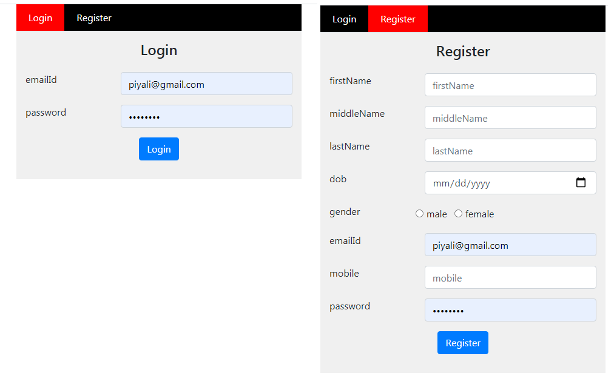

# Dynamic Login Registration form in React js

1. At a time only one form will be present in DOM
2. Channing the form fields of form coponent

### Run Application
```
npm start
http://localhost:3000/
```

### Reference URL
https://stackoverflow.com/questions/41296668/reactjs-form-input-validation
https://goshakkk.name/submit-time-validation-react/
http://jsfiddle.net/5e6zr2Lq/1/
https://medium.com/@justintulk/best-practices-for-resetting-an-es6-react-components-state-81c0c86df98d




### Form Component
Form is Class based component
This component is used to create Form and passing form fields value

```
<form className="mt-4" ref={form => this.form = form} onSubmit={this.formSubmit}>
                {
                    this.props.formFields.map(ele => {
                        return (
                            <Formfield
                            ele={ele}
                            key={ele.key}
                            handleChange={this.handleChange}
                            ></Formfield>
                        )
                    })
                }
                <div className="form-group text-center">
                    <button className="btn btn-primary" type="submit">{this.props.btnName}</button>
                </div>
            </form>
```


### Formfield Component
Formfield is a Function Component
This component is used to generate form fields regarding field values

```
const Formfield = (props) => {
    console.log(props);
    const {ele:{input, key, required, items}, handleChange} = props;
    return (
        <div className="form-group" key={key}>
        {
            (input === 'text' || input === 'email' || input === 'password' || input === 'number' || input === 'date') ? (
                <div className="row">
                    <label className="col-md-4">{key}</label>
                        <div className="col-md-8">
                            <input
                            className="form-control"
                            type={input}
                            name={key}
                            placeholder={key}
                            required={required}
                            onChange={handleChange}/>
                        </div>
                </div> 
            ) : (
                <React.Fragment>
                  {
                     (input === 'radio')? (
                        <div className="row">
                        <label className="col-md-4">{key}</label>
                        {
                            items.map(eleRadio => (
                                <div className="form-check-inline" key={eleRadio.name}>
                                    <label className="form-check-label">
                                        <input
                                        type={input}
                                        className="form-check-input"
                                        name={key}
                                        placeholder={eleRadio.name}
                                        required={required}
                                        value={eleRadio.name}
                                        onChange={handleChange}/>
                                        {eleRadio.name}
                                    </label>
                                </div>
                            ))
                        }
                        </div>
                     ) : (
                        <div className="row">
                        <label className="col-md-4">{key}</label>
                        <div className="col-md-8">
                            <textarea 
                            className="form-control"
                            name={key}
                            placeholder={key}
                            onChange={handleChange}
                            required={required}></textarea>
                        </div>
                    </div>
                     )
                  }
                </React.Fragment>
            )
               
        }
        </div>                  
    )
}
```


Constructor: Constructor is Used to initialize the state.

State : Components that contain local state have a property called "this.state".

What will happen if I use setState() function in constructor of a Class in ReactJS or React Native?
SetState: React components have a method available to them called setState Calling "this.setState" causes React to re-render your application and update the DOM.you can also track of prevstate in setState If you use setState in constructor you would get error like this:Can only update a mounted or mounting component. This usually means you called setState() on an unmounted component.


